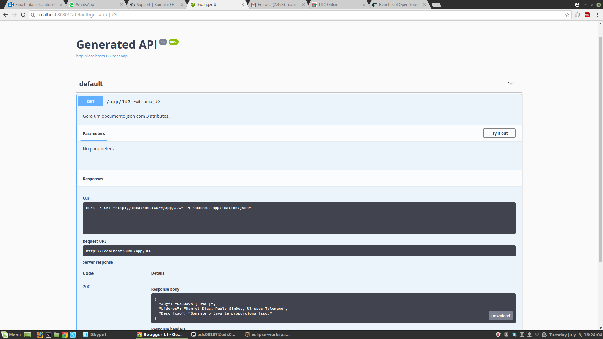

# Exemplo MicroProfile-Payara-Micro

## Tech Stack
* Java 8
* Maven 3(Versão mínima)
* Jax-RS,CDI,JSON-P 
* Docker
* Payara-micro

## Executando o projeto

mvn clean install payara-micro:bundle - para gerar o uber-Jar

mvn  payara-micro:start - para executar o app

ou java -jar microprofile-sample-microbundle.jar dentro da pasta target/

URL -> http://locahost:8080/microprofile-payara-0.0.1-SNAPSHOT/app/JUG

# Docker

No local do Dockerfile executar :

## BUILD 

sudo docker build -t microprofile-payara-demo .

logo depois :

## executar

sudo docker run --name demo -p 8080:8080 -h localhost microprofile-payara-demo

acesse a URL -> http://localhost:8080/microprofile-payara-0.0.1-SNAPSHOT/app/JUG

acessar o MicroProfile OpenAPI -> http://localhost:8080/openapi/

#Swagger

  

## Para e remover o Container

sudo docker stop demo

sudo docker rm demo

## Links informativos

* Payara-Micro [Payara-Micro](https://www.payara.fish/payara_micro)

